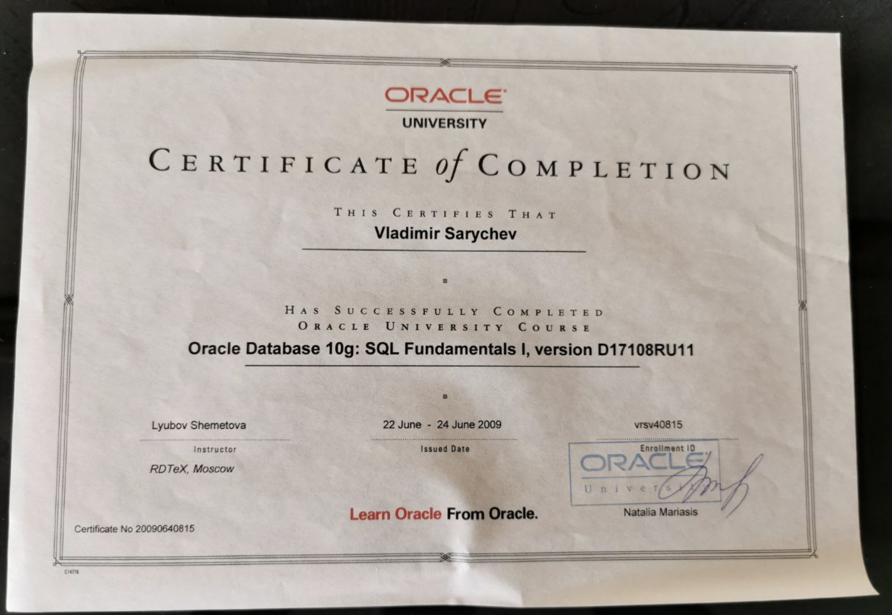
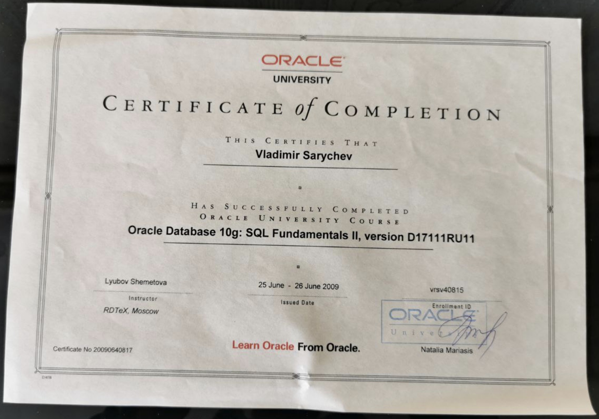
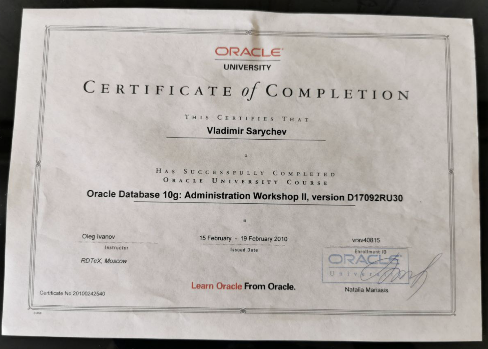
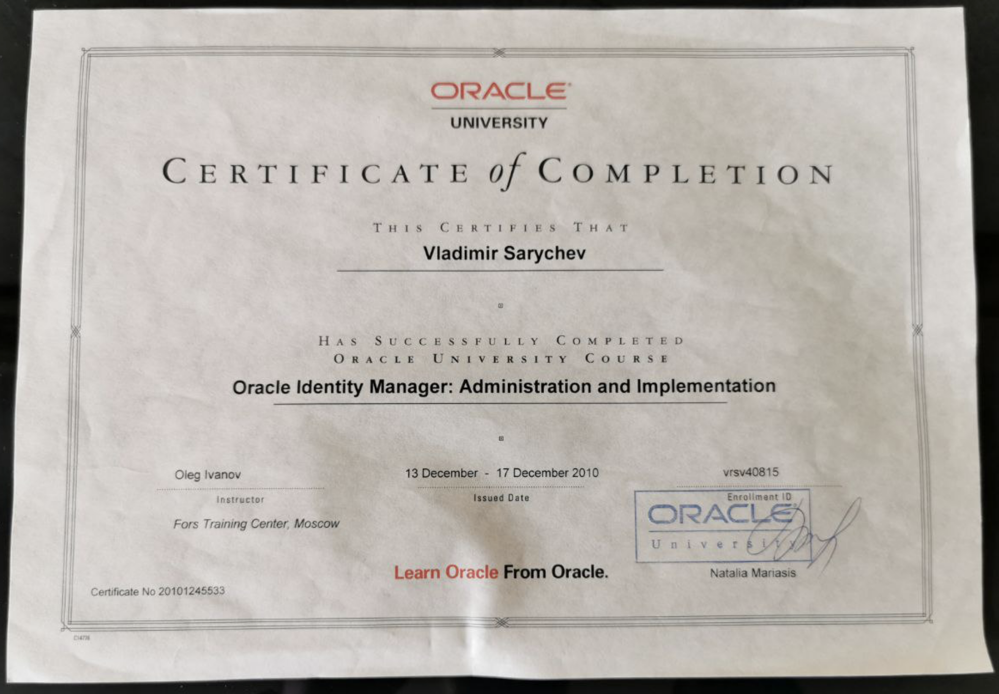

# Привет, я Владимир 👋

## QA Lead | Стратегия качества · Управление командой · Автоматизация тестирования

Помогаю командам создавать надёжные продукты, делая качество понятной и общей частью процесса разработки.

### Чем занимаюсь

- Формирую и улучшаю QA-процессы и стратегии тестирования
- Руковожу и помогаю развиваться QA-инженерам
- Планирую тестирование, управляю рисками релизов и делаю качество измеримым через метрики
- Работаю с продуктовыми и инженерными командами, чтобы предотвращать дефекты на ранних этапах
- Исследую Python- и LLM-инструменты для автоматизации QA

### Ключевые направления

`QA Leadership` · `Стратегия тестирования` · `Качество ПО` · `Автоматизация тестирования` · `UI / API-тестирование` · `Python` · `Java` · `LLM в QA`

### Практический стек

`Python` · `Pytest` · `Playwright` · `Selenium` · `Selene` · `Java` · `JUnit 5` · `Selenide` · `REST Assured` · `Appium` · `Requests` · `Allure Report` · `Gradle` · `FastAPI` · `PostgreSQL` · `Docker` · `Jenkins` · `Git`

### Сертификаты

- QA.GURU: [Python QA Automation Engineer](assets/certificates/python/2026-08-07%2021.18.59.jpg) (2024), [Java QA Automation Engineer](assets/certificates/java/photo_2026-08-07%2021.01.44.jpeg) (2025) и [Java Advanced QA Automation Engineer](assets/certificates/java/photo_2026-08-07%2021.00.15.jpeg) (2026)
- OTUS: [QA Lead](assets/certificates/qa_lead/2026-08-07%2021.18.51.jpg) (2024)
- Oracle University: [SQL Fundamentals I](assets/certificates/oracle/oracle_fundamentals_1.png), [SQL Fundamentals II](assets/certificates/oracle/oracle_fundamentals_2.png), [Database Administration Workshop II](assets/certificates/oracle/admin_oracle_2.png) и [Identity Manager: Administration and Implementation](assets/certificates/oracle/admin_oracle.png)
- QA.GURU: [Основы автоматизации тестирования ПО](assets/certificates/python/2026-08-07%2021.18.42.jpg)

Открыть сканы сертификатов

 

 

 

### Избранные проекты

- [Renovation Planner](https://github.com/svmyhome/Apartment) — веб-приложение для планирования ремонта: проекты, комнаты, покупки и контроль бюджета. Разрабатываю API на FastAPI с PostgreSQL, SQLAlchemy и Alembic; в планах — клиенты для Android и iOS на общем API.
- [Lenta — автотесты](https://github.com/svmyhome/lenta) — дипломный проект по автоматизации web-, API- и Android-тестирования на Java. Использую JUnit 5, Selenide, REST Assured, Appium, Allure, Jenkins, Selenoid и BrowserStack.
- [E2E-тесты DemoQA](https://github.com/svmyhome/demoqa10-e2e-tests) — практика автоматизации UI-, API- и мобильного тестирования на Python: Pytest, Selene, Requests, Appium и Allure Report; настройка запусков в Jenkins и Selenoid.
- [Python Playwright](https://github.com/svmyhome/pythonPlaywright) — проект UI-автоматизации на Python с Pytest и Playwright.

### Сейчас изучаю

- Практическое применение LLM в тестировании
- Автоматизацию повторяющихся QA-процессов на Python
- Проектирование тестов и анализ требований с помощью ИИ

### Профили

- [GitHub](https://github.com/svmyhome)
- [Stepik](https://stepik.org/users/188203919/profile)

---

_Открыт к обмену идеями о качестве ПО, QA-лидерстве и применении ИИ в тестировании._
